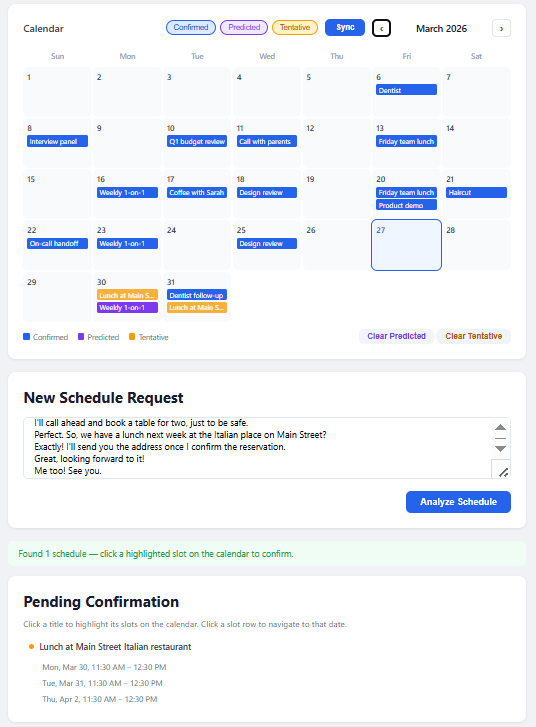

# AutoScheduler

A scheduling agent synced with Google Calendar. It suggests tentative time slots by automatically avoiding predicted recurring events.



---

## Features

- **Natural language input** — describe what you need, and the agent extracts events and finds available time slots (Using OpenAI API)
- **Google Calendar sync** — confirm or remove events directly in Google Calendar
- **Pattern detection** — detects recurring events from existing schedules and predicts future ones
- **Conflict-aware scheduling** — avoid overlap with confirmed or predicted events

---

## Library Stacks

| Layer | Details |
|---|---|
| Frontend | JS, HTML/CSS |
| Backend | Python, FastAPI |
| LLM | OpenAI API · LangChain |
| Calendar | Google Calendar API (OAuth2 PKCE) |
| Database | SQLite |

---

## Getting Started

### Installation

1. Place your Google OAuth credentials at `config/client_secret.json`
   - Create at [console.cloud.google.com](https://console.cloud.google.com/) → APIs & Services → Credentials → OAuth client ID (Web application)

2. Set your OpenAI key:
   ```bash
   # Edit .env and fill in OPENAI_API_KEY

   cp .env.example .env
   ```

   Default model is GPT-5-nano. Change it in config/config.yaml

3. Start the app
   ```bash
   # Backend (Terminal 1)
   python run.py
 
   # Frontend (Terminal 2)
   npm start
   ```

   Open **http://localhost:3000**, sign in with Google.


---

## How It Works

```
Type a message
       ↓
LLM extracts events + proposes time slots (category-aware)
       ↓
Slots shown as tentative on calendar
       ↓
Click a slot → Confirm → Upload to Google Calendar
```

On every **Sync**, AutoScheduler also:
- Pulls the latest events from Google Calendar
- Detects recurring patterns (median interval, ±35% jitter, 365-day window)
- Predicted schedules can be confirmed by user.

---

## Project Structure

```
AutoScheduler/
├── config/            # config.yaml, client_secret.json
├── src/
│   ├── agent.py       # Orchestration
│   ├── api/           # FastAPI routes (auth, events, config)
│   └── modules/       # extractor, scheduler, gcal, db, models
├── web/public/        # Frontend (index.html, app.js, calendar.js)
├── run.py             # Entry point
└── requirements.txt
```
